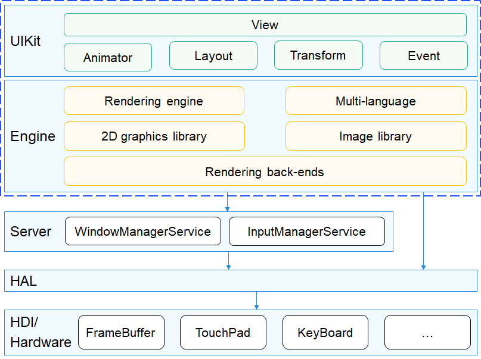

# 图形UI组件<a name="ZH-CN_TOPIC_0000001123180295"></a>

-   [简介](#section11660541593)
-   [目录](#section161941989596)
-   [约束](#section119744591305)
-   [编译构建](#section137768191623)
-   [说明](#section1312121216216)
    -   [组件说明](#section66002422015)
    -   [使用说明](#section129654513264)

-   [相关仓](#section1371113476307)

## 简介<a name="section11660541593"></a>

图形UI组件实现了一套系统级的图形引擎。

该组件为应用开发提供UIKit接口，包括了动画、布局、图形转换、事件处理，以及丰富的UI组件。

组件内部直接调用HAL接口，或者使用WMS\(Window Manager Service\)提供的客户端与硬件交互，以完成事件响应、图像绘制等操作。

**图 1**  图形子系统架构图<a name="fig1358754417214"></a>  


## 目录<a name="section161941989596"></a>

```
/foundation/graphic/ui
├── frameworks                  # 框架代码
│   ├── animator                # 动画模块
│   ├── common                  # 公共模块
│   ├── components              # 组件
│   ├── core                    # ui主流程（渲染、任务管理等）
│   ├── default_resource
│   ├── dfx                     # 维测功能
│   ├── dock                    # 驱动适配层
│   │   └── ohos                # ohos平台适配
│   ├── draw                    # 绘制逻辑
│   ├── engines                 # 绘制引擎
│   │   ├── dfb
│   │   ├── general
│   │   ├── gpu_vglite
│   │   └── software_zlite
│   ├── events                  # 事件
│   ├── font                    # 字体
│   ├── imgdecode               # 图片管理
│   ├── layout                  # 页面布局
│   ├── themes                  # 主题管理
│   ├── window                  # 窗口管理适配层
│   └── window_manager
│       └── dfb
├── interfaces                  # 接口
│   ├── innerkits               # 模块间接口
│   │   └── xxx                 # 子模块的接口
│   └── kits                    # 对外接口
│       └── xxx                 # 子模块的接口
├── test                        # 测试代码
│   ├── framework
│   │   ├── include             # 测试框架头文件
│   │   └── src                 # 测试框架源码
│   ├── uitest                  # 显示效果测试(可执行程序在foundation/graphic/wms/test:sample_ui)
│   │   └── test_xxx            # 具体UI组件效果测试
│   └── unittest                # 单元测试
│       └── xxx                 # 具体UI组件单元测试
└── tools                       # 测试和模拟器工具（模拟器工程、资源文件）
    └── qt                      # QT工程
```

## 约束<a name="section119744591305"></a>

平台约束

-   Windows平台仅支持QT和OHOS IDE。
-   其他平台支持情况参考vender/hisilicon/\[product\_name\]/config.json中的graphic标签（不存在graphic标签即该产品不存在图形子系统）。

## 编译构建<a name="section137768191623"></a>

```
# 通过gn编译，在out目录下对应产品的文件夹中生成libui.so
hb build lite_ui

# 编译qt库可直接参考qt模拟器工程：graphic/ui/tools/qt/simulator/simulator.pro
```

## 说明<a name="section1312121216216"></a>

### 组件说明<a name="section66002422015"></a>

组件分为基础组件和容器组件

-   基础组件：仅实现组件自身单一功能，比如按钮、文字、图片等；
-   容器组件：可将其他组件作为自己的子组件，通过组合实现复杂功能。

**图 2**  图形组件一览<a name="fig1594213196218"></a>  


### 使用说明<a name="section129654513264"></a>

foundation/graphic/ui/test/uitest中提供了图形所有组件和功能接口的使用范例。

-   Windows环境可运行QT工程调试

    工程文件路径：

    ```
    graphic/ui/tools/qt/simulator/simulator.pro
    ```

-   其他调试环境可以编译运行foundation/graphic/wms/test:sample\_ui

    ```
    hb build lite_wms -b debug
    ```

    编译成功后得到可执行程序out/\[product\_name\]/dev\_tools/bin/sample\_ui，在实际环境上运行即可观察对应组件显示效果。


## 相关仓<a name="section1371113476307"></a>

[图形子系统](https://gitee.com/openharmony/docs/blob/master/zh-cn/readme/%E5%9B%BE%E5%BD%A2%E5%AD%90%E7%B3%BB%E7%BB%9F.md)

[graphic_wms](https://gitee.com/openharmony/graphic_wms/blob/master/README_zh.md)

[graphic_surface](https://gitee.com/openharmony/graphic_surface/blob/master/README_zh.md)

[graphic_utils](https://gitee.com/openharmony/graphic_utils/blob/master/README_zh.md)